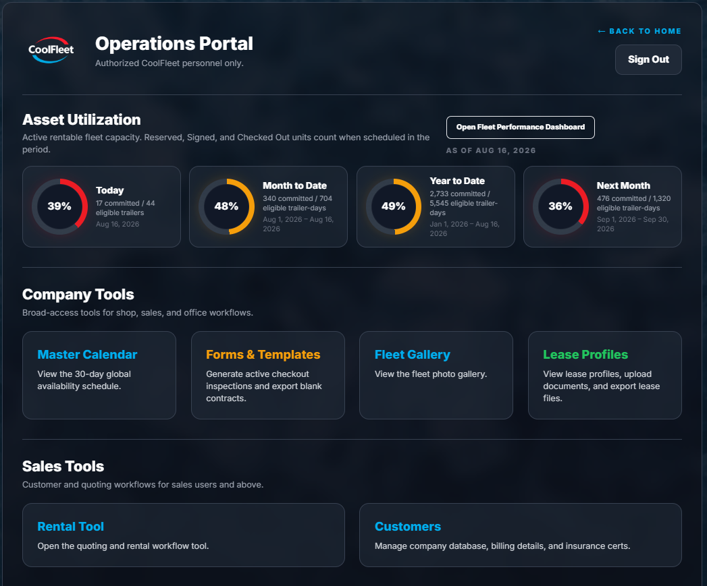
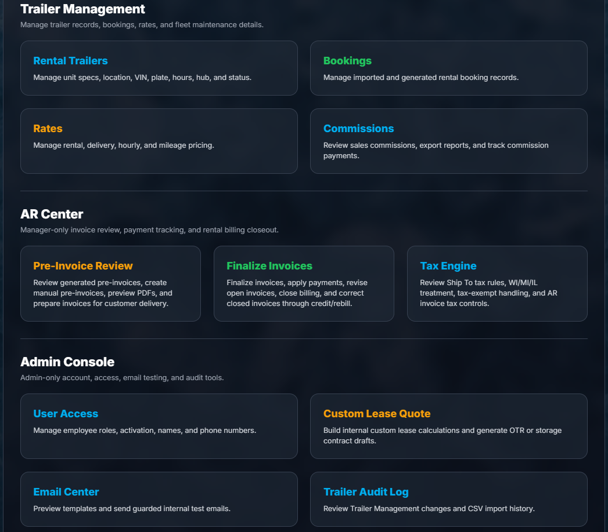
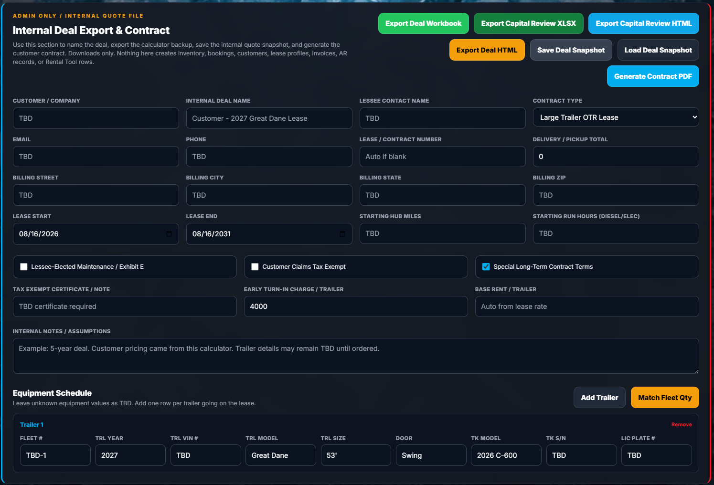

<!-- GitHub profile README for @treinart -->

  

  <a href="https://www.linkedin.com/in/travis-reinart/">LinkedIn</a>
  &nbsp;•&nbsp;
  <a href="https://truckerintelligence.com/">TruckerIntelligence</a>
  &nbsp;•&nbsp;
  <a href="https://coolfleetleasing.com/">CoolFleet Leasing</a>

I build practical software that brings data, automation, and day-to-day decisions into the same place. My work ranges from commercial fleet intelligence and leasing systems to machine-learning projects, interactive tools, and private operational software.

## Selected Product Work

### TruckerIntelligence

**Founder & Developer** &nbsp;·&nbsp; [Visit the product site](https://truckerintelligence.com/)

A commercial desktop platform for teams selling to and researching DOT-regulated fleets. It brings fleet mapping, targeted filtering, account research, lightweight CRM workflow, and export tools into one product.

  
  
  

### CoolFleet Leasing

**Platform Architect & Developer** &nbsp;·&nbsp; [Visit the product site](https://coolfleetleasing.com/)

A leasing and rental operations platform that connects asset utilization, scheduling, rentals, bookings, rates, commissions, lease profiles, invoicing, tax handling, secure access, and contract generation in one working system.

  
  
  

### Dealership Operations Intelligence

**Developer** &nbsp;·&nbsp; Private local application

A private decision-support platform designed to turn operating data into direct reporting, usable analysis, and clearer daily decisions. The source and visual details remain private.

## Graduate Study

  

Selected graduate work spans machine learning, probability and statistics, intelligent agents and search, knowledge representation under uncertainty, deep learning, natural language processing, robotics, autonomous systems, and financial modeling.

## Selected Public Work

| Repository | Focus |
| --- | --- |
| [CSCA 5622 — Supervised Learning](https://github.com/treinart/CSCA-5622-Supervised-Learning-Final-Project) | Customer performance analysis through regression using an anonymized synthetic dataset. |
| [CSCA 5632 — Unsupervised Machine Learning](https://github.com/treinart/CSCA-5632-Unsupervised-Algorithms-in-Machine-Learning) | Text classification, recommender systems, and autonomous-vehicle trajectory analysis. |
| [CSCA 5642 — Deep Learning](https://github.com/treinart/CSCA-5642-Introduction-to-Deep-Learning) | Computer vision, NLP, generative models, and a truck fuel-rate prediction project. |
| [EMEA 5023 — Financial Forecasting & Reporting](https://github.com/treinart/EMEA-5023-Financial-Forecasting-and-Reporting) | Financial statement and ratio analysis of Trane Technologies, with a published report. |
| [Linear Algebra Matrix Calculator](https://github.com/treinart/Linear-Algebra-Matrix-Calculator) | Interactive browser-based calculator with step-by-step support for 56 matrix and vector operations. |
| [JHU Data Scientist's Toolbox](https://github.com/treinart/JHU-Data-Scientists-Toolbox) | R, R Markdown, Git, GitHub, and reproducible reporting foundations. |
| [Remembering Dave Reinart](https://github.com/treinart/remembering-dave-reinart) | A memorial site made for my dad, so family and friends have one place for his stories and celebration details. |

Public work is shared where it adds value. Private product work is described without exposing source, business data, or implementation details.
