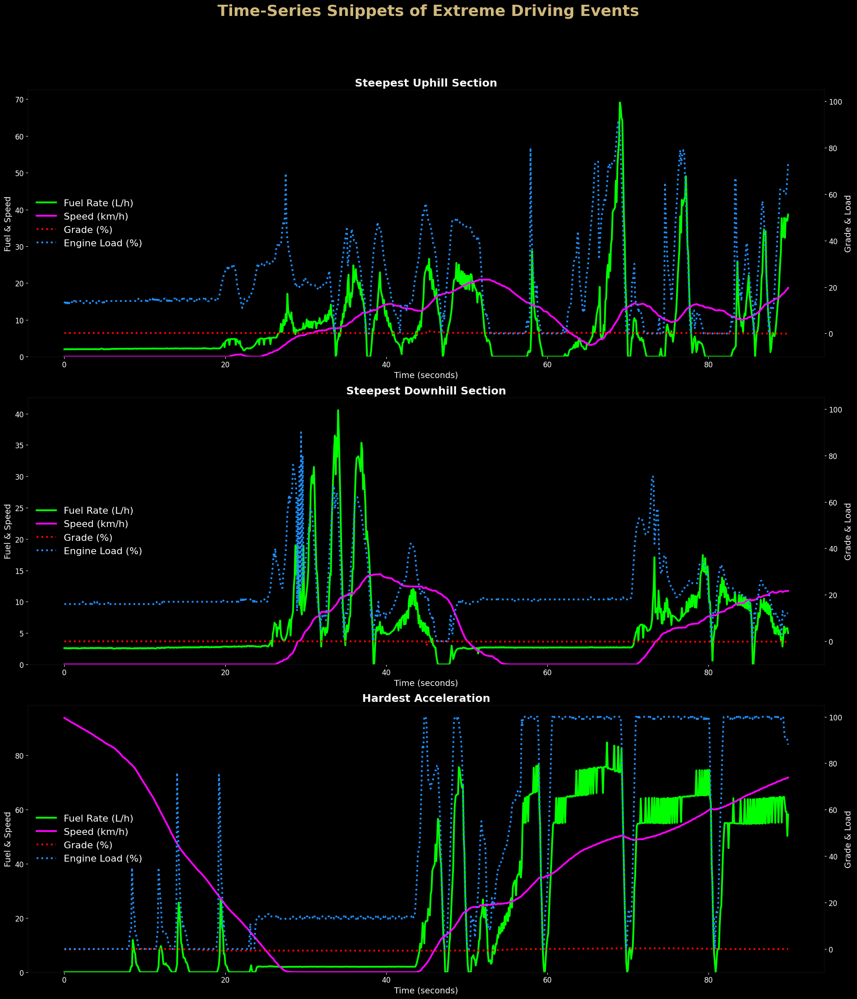
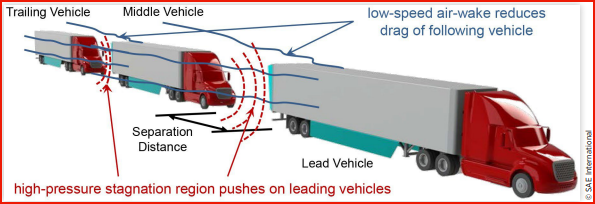
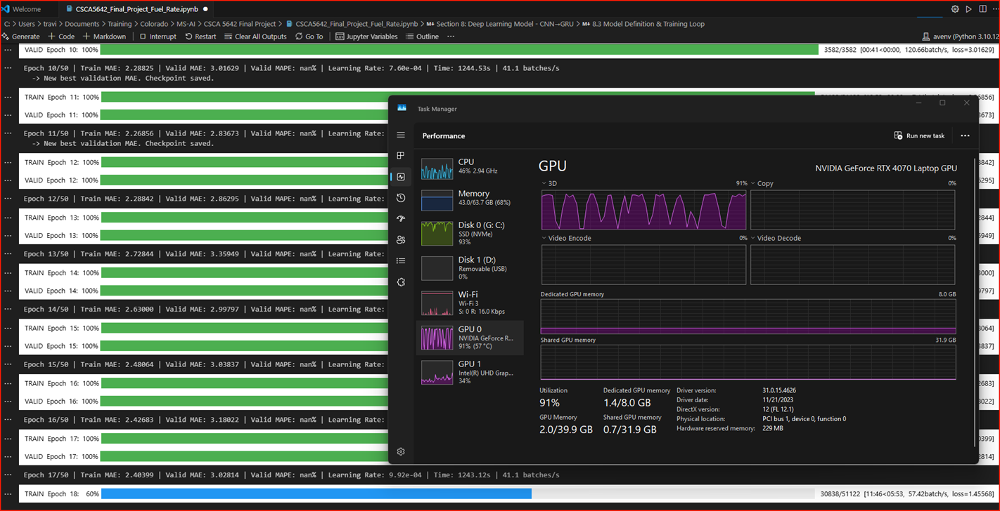
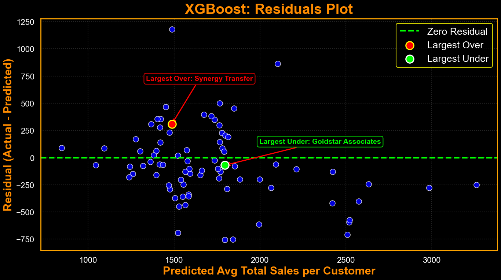
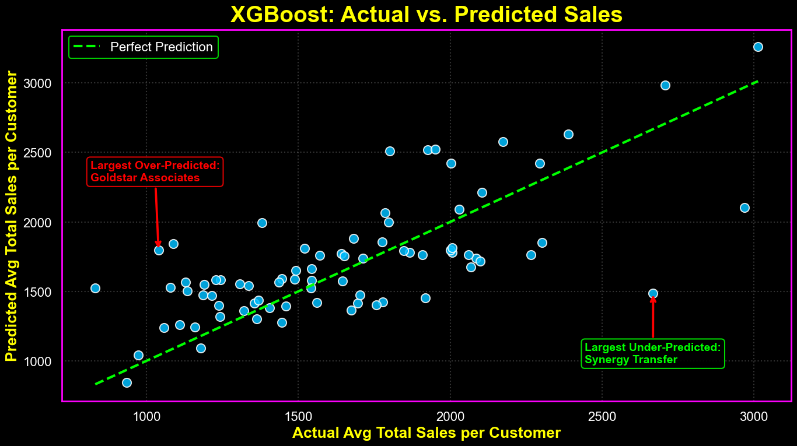

  

  <h1>Applied AI | Machine Learning | Software Development</h1>
  
M.S. in Artificial Intelligence, University of Colorado Boulder

  

    <a href="https://www.linkedin.com/in/travis-reinart/">LinkedIn</a>&nbsp;&nbsp;&nbsp;|&nbsp;&nbsp;&nbsp;
    <a href="https://truckerintelligence.com/">TruckerIntelligence.com</a>&nbsp;&nbsp;&nbsp;|&nbsp;&nbsp;&nbsp;
    <a href="mailto:Travis@TruckerIntelligence.com">Travis@TruckerIntelligence.com</a>
  

---

## Commercial Software

### TruckerIntelligence

**Founder & Developer**

Created and built TruckerIntelligence, a subscription-based Windows desktop application that turns 2.2M+ FMCSA fleet records into a working sales-intelligence system for dealership and OEM teams.

- Designed the platform around the complete field-sales workflow: territory mapping, targeted fleet filtering, account research, a lightweight CRM, activity and follow-up tracking, browser-based research, and Excel/PDF exports.
- Built and operate the product-delivery and marketing infrastructure, including EV code-signed Windows installers, encrypted licensing, Cloudflare R2 customer distribution, Stripe Checkout, Google Ads conversion tracking, and database-backed unsubscribe controls.
- Configured Docker-hosted LedgerSMB and PostgreSQL accounting, then built an Electron desktop wrapper and Python sales-import and audit tooling to replace an awkward localhost workflow with a usable Windows application.

  

    <a href="https://truckerintelligence.com/">Visit TruckerIntelligence.com</a>&nbsp;&nbsp;&nbsp;|&nbsp;&nbsp;&nbsp;
    <a href="https://www.linkedin.com/company/truckerintelligence/">TruckerIntelligence on LinkedIn</a>
  

<table width="100%" style="width: 100%; table-layout: fixed;">
  <tr>
    <td width="33.33%" valign="top"></td>
    <td width="33.33%" valign="top"></td>
    <td width="33.33%" valign="top"></td>
  </tr>
</table>

### CoolFleet Leasing

**Platform Architect & Developer**

Identified gaps and manual handoffs in equipment rental and leasing, then designed a phased digital platform connecting sales, operations, customers, contracts, assets, and reporting.

- Built Phase 1 as an end-to-end leasing workflow from salesperson entry through automated contract generation and delivery, e-signature, document upload, calendar scheduling, invoicing, commission reporting, transaction tracking, and asset-utilization analytics.
- Designed the application architecture using Supabase for database, authentication, storage, and access controls; Netlify for hosting and serverless logic; Cloudflare for DNS and security; and Resend for transactional email.
- Developed Phase 2 customer self-service booking, allowing customers to enter their information, select available equipment, and complete the front end of the transaction before salesperson involvement. The platform is structured to support a multi-dealer rental and leasing network.

  

    <a href="https://coolfleetleasing.com/">Visit CoolFleetleasing.com</a>
  

<table width="100%" style="width: 100%; table-layout: fixed;">
  <tr>
    <td width="33.33%" valign="top"></td>
    <td width="33.33%" valign="top"></td>
    <td width="33.33%" valign="top"></td>
  </tr>
</table>

### Dealership Operations Intelligence Platform

**Developer**

Designed and built a local operations-intelligence platform that turns Power BI and operating-system exports into clear visual reporting and automated analysis for service writers, technicians, field and route sales, and location leadership, so people can act without digging through spreadsheets.

- Created modular dashboards for service, parts, technician efficiency, financials, inventory, commission, telematics, ROI, and customer trends, with KPI scorecards, rankings, heat maps, year-over-year and month-over-month comparisons, and variance analysis.
- Built the local HTML5 application in modular JavaScript and Tailwind CSS, using Chart.js for interactive visualizations and SheetJS, jsPDF, and html2canvas to produce spreadsheet, PDF, and image exports.
- Developed Python data pipelines for ingestion, validation, normalization, upserts, audit records, and Excel processing, with Node.js and Playwright automating daily service and location-performance report packages.

---

## Graduate AI and Machine Learning Work

### [CSCA 5642 · Introduction to Deep Learning](https://github.com/treinart/CSCA-5642-Introduction-to-Deep-Learning)

This repository is four distinct deep-learning projects with a clear progression from model development and competition work to an applied transportation final project.

- **Histopathologic cancer detection:** progressed from a single-fold ResNet50 baseline to a five-fold EfficientNetV2-S ensemble with four-view test-time augmentation, reaching a **0.9814 private Kaggle score**.
- **NLP with Disaster Tweets:** compared TF-IDF baselines, a BiGRU with GloVe embeddings and attention, and fine-tuned DeBERTa-v3-base. The DeBERTa model reached a **0.84615 Kaggle F1**.
- **CycleGAN image generation:** built a Monet-style image generator for Kaggle’s *I’m Something of a Painter Myself* competition. Fine-tuning and test-time augmentation reduced MiFID from **69.06** to **57.83**, reaching **#11** on the public leaderboard at publication.
- **CNN-to-GRU truck fuel-rate prediction:** compared an XGBoost baseline with a sequence model that used a CNN for feature extraction and a GRU for temporal dependencies. The CNN-to-GRU model reached **0.95 L/hr validation MAE**. The final analysis isolated sustained highway platoon runs, compared its measured results against conservative literature benchmarks, and found **8.3% savings for two trucks** and **12.2% for three trucks**.

  

    <a href="https://github.com/treinart/CSCA-5642-Introduction-to-Deep-Learning">Repository</a>&nbsp;&nbsp;&nbsp;|&nbsp;&nbsp;&nbsp;
    <a href="https://treinart.github.io/CSCA-5642-Introduction-to-Deep-Learning/Truck_Platooning_ROI_Calculator_v9.html">Open the interactive Truck Platooning ROI Calculator</a>
  

<table width="100%" style="width: 100%; table-layout: fixed;">
  <tr>
    <td width="33.33%" valign="top"></td>
    <td width="33.33%" valign="top"></td>
    <td width="33.33%" valign="top"></td>
  </tr>
</table>

### [CSCA 5632 · Unsupervised Algorithms in Machine Learning](https://github.com/treinart/CSCA-5632-Unsupervised-Algorithms-in-Machine-Learning)

The Lyft Level 5 final project reframed autonomous-vehicle motion-prediction data as an unsupervised behavior-discovery problem. Instead of predicting one future path, the work asks which recurring driving behaviors exist in raw trajectories and whether a learned representation separates them better than hand-built features.

The comparison uses two pipelines: hand-engineered trajectory features with PCA and KMeans, versus a GRU autoencoder that learns embeddings before KMeans. The learned-embedding pipeline produced a **0.935 silhouette score** versus **0.558** for the classical approach and an **ARI of 0.996** versus **0.779**. The repository also documents a BBC News comparison of TF-IDF plus NMF against BERT embeddings, and a MovieLens study that explains why standard NMF and Truncated SVD weaken when more than 96% of the ratings matrix is missing.

  

    <a href="https://github.com/treinart/CSCA-5632-Unsupervised-Algorithms-in-Machine-Learning">Repository</a>
  

  <video src="https://github.com/treinart/CSCA-5632-Unsupervised-Algorithms-in-Machine-Learning/raw/refs/heads/main/Week%205/scenario_replay/scenario_replay_cluster_20250917_221138.mp4" controls autoplay muted loop playsinline width="50%">
    CSCA 5632 scenario replay video.
  </video>

### [CSCA 5622 · Introduction to Machine Learning: Supervised Learning](https://github.com/treinart/CSCA-5622-Supervised-Learning-Final-Project)

A supervised regression project that models customer performance by predicting average total sales per invoice across labor and parts, then identifying the business factors associated with customer value.

The work includes a custom Python data generator that builds a realistic dealership invoice dataset from business logic and operating KPIs, plus a reproducible Jupyter analysis with exploratory work, model comparison, feature interpretation, and a formatted final report. The project uses pandas, NumPy, scikit-learn, SciPy, XGBoost, matplotlib, and seaborn.

  

    <a href="https://github.com/treinart/CSCA-5622-Supervised-Learning-Final-Project">Repository</a>
  

<table width="100%" style="width: 100%; table-layout: fixed;">
  <tr>
    <td width="50%" valign="top"></td>
    <td width="50%" valign="top"></td>
  </tr>
</table>

---

## Applied Analysis, Tools, and Personal Work

### [EMEA 5023 · Financial Forecasting and Reporting](https://github.com/treinart/EMEA-5023-Financial-Forecasting-and-Reporting)

A full financial-statement analysis of Trane Technologies plc built from the 2025 annual report, Form 10-K, SEC filings, and investor materials. The report works through the income statement, balance sheet, cash-flow statement, liquidity, asset management, profitability, debt management, investment, and market-value ratios, then compares 2023 through 2025 trends.

The final assessment ties the calculations back to the company’s financial position, including margin expansion, cash generation, liquidity, leverage, and earnings-per-share trends. [Read the live analysis](https://treinart.github.io/EMEA-5023-Financial-Forecasting-and-Reporting/).

### [Linear Algebra Matrix Calculator](https://github.com/treinart/Linear-Algebra-Matrix-Calculator)

A browser-based linear-algebra tool built around explanation, not just answers. It covers 56 matrix and vector operations, including row reduction, determinants, inverses, eigenvalues and eigenvectors, SVD, QR and LU decompositions, Gram-Schmidt, least squares, and change of basis.

Each operation shows the calculation step by step, explains the underlying math and practical context, and is supported by companion Python implementations. [Open the live calculator](https://treinart.github.io/Linear-Algebra-Matrix-Calculator/).

### [JHU Data Scientist's Toolbox](https://github.com/treinart/JHU-Data-Scientists-Toolbox)

The foundation project for the Johns Hopkins Data Science Specialization. It documents a working RStudio project connected to GitHub through version control, with R scripts, an R Markdown source file, a rendered HTML report, a PDF export, and the required repository workflow evidence.

[Read the rendered R Markdown report](https://treinart.github.io/JHU-Data-Scientists-Toolbox/assemble-your-toolbox.html).

### [Remembering Dave Reinart](https://github.com/treinart/remembering-dave-reinart)

A public memorial website created for my dad, David "Dave" Reinart. It brings together Celebration of Life details, obituary resources, photographs, and the stories that matter to family and friends. The static Netlify site also includes a printable PDF, search-indexing files, security contact metadata, and a plain-language summary for AI tools.

[Visit the memorial site](https://remembering-dave-reinart.netlify.app/).

---

## Graduate Study

<table width="100%" bgcolor="#000000" border="3" bordercolor="#CFB87C" cellpadding="12" cellspacing="0">
  <tr>
    <td width="34%" valign="middle">
       
      <strong>COLLEGE OF ENGINEERING &amp; APPLIED SCIENCE</strong>
    </td>
    <td width="48%" valign="middle">
      <strong>Master of Science in Artificial Intelligence</strong> 
      Graduate study includes machine learning, probability and statistics, autonomous systems, robotics, AI systems, knowledge representation and uncertainty modeling, with applied Python-based modeling and analysis.
    </td>
    <td width="18%" align="right" valign="top">
      <strong>GPA 3.924</strong> 
      <strong>EXPECTED DECEMBER 2026</strong>
    </td>
  </tr>
</table>

<table width="100%" bgcolor="#000000" cellpadding="0" cellspacing="0">
  <tr>
    <td width="8" bgcolor="#CFB87C">&nbsp;</td>
    <td>
      <table width="100%" cellpadding="14" cellspacing="0">
        <tr>
          <td width="70%" valign="middle">
            <strong>Graduate Coursework by Specialty</strong> 
            Completed graduate coursework across artificial intelligence, machine learning, robotics, language, autonomous systems, and financial analysis.
          </td>
          <td width="30%" align="right" valign="middle">
            
          </td>
        </tr>
      </table>
      

      <table width="100%" border="1" bordercolor="#333333" cellpadding="9" cellspacing="0">
        <tr bgcolor="#111111">
          <th width="34%" align="left">Specialty</th>
          <th width="66%" align="left">Graduate Courses</th>
        </tr>
        <tr>
          <td valign="top"><strong>Machine Learning: Theory and Hands-on Practice with Python</strong></td>
          <td valign="top"><a href="https://www.colorado.edu/cs/academics/online-programs/mscs-coursera/csca5622">CSCA 5622 · Introduction to Machine Learning: Supervised Learning</a> <a href="https://www.colorado.edu/cs/academics/online-programs/mscs-coursera/csca5632">CSCA 5632 · Unsupervised Algorithms in Machine Learning</a> <a href="https://www.colorado.edu/cs/academics/online-programs/mscs-coursera/csca5642">CSCA 5642 · Introduction to Deep Learning</a></td>
        </tr>
        <tr>
          <td valign="top"><strong>Foundations of Probability and Statistics</strong></td>
          <td valign="top"><a href="https://www.colorado.edu/cs/appa-5001-probability-foundations-data-science-and-ai-1">APPA 5001 · Probability Foundations for Data Science and AI 1</a> <a href="https://www.colorado.edu/cs/appa-5002-discrete-time-markov-chains-and-monte-carlo-methods">APPA 5002 · Discrete-Time Markov Chains and Monte Carlo Methods</a> <a href="https://www.colorado.edu/cs/appa-5003-statistical-estimation-data-science-and-ai">APPA 5003 · Statistical Estimation for Data Science and AI</a></td>
        </tr>
        <tr>
          <td valign="top"><strong>Artificial Intelligence Ethics</strong></td>
          <td valign="top"><a href="https://www.colorado.edu/cs/csca-5204-current-issues-ethics-and-ai">CSCA 5204 · Current Issues in Ethics and AI</a> <a href="https://www.colorado.edu/cs/academics/online-programs/mscs-coursera/csca5274">CSCA 5274 · AI Ethics and Society's Future</a> CSCA 5284 · AI Ethics and Policy</td>
        </tr>
        <tr>
          <td valign="top"><strong>Artificial Intelligence</strong></td>
          <td valign="top"><a href="https://www.colorado.edu/cs/academics/online-programs/mscs-coursera/csca5002">CSCA 5002 · Intelligent Agents and Search Algorithms</a> <a href="https://www.colorado.edu/cs/academics/online-programs/mscs-coursera/csca5012">CSCA 5012 · Knowledge Representation and Reasoning Under Uncertainty</a> <a href="https://www.colorado.edu/cs/academics/online-programs/mscs-coursera/csca5022">CSCA 5022 · Introduction to Learning</a></td>
        </tr>
        <tr>
          <td valign="top"><strong>Foundations of Reinforcement Learning</strong></td>
          <td valign="top"><a href="https://www.colorado.edu/cs/academics/online-programs/mscs-coursera/csca5902">CSCA 5902 · Mastering Classic Reinforcement Learning Algorithms</a> <a href="https://www.colorado.edu/cs/academics/online-programs/mscs-coursera/csca5912">CSCA 5912 · Deep Reinforcement Learning: From Theory to Practice</a> <a href="https://www.colorado.edu/cs/academics/online-programs/mscs-coursera/csca5922">CSCA 5922 · Reward Programming: Optimizing RL Efficiency and Safety</a></td>
        </tr>
        <tr>
          <td valign="top"><strong>Introduction to Robotics with Webots</strong></td>
          <td valign="top"><a href="https://www.colorado.edu/cs/academics/online-programs/mscs-coursera/csca5312">CSCA 5312 · Basic Robotic Behaviors and Odometry</a> <a href="https://www.colorado.edu/cs/academics/online-programs/mscs-coursera/csca5332">CSCA 5332 · Robotic Mapping and Trajectory Generation</a> <a href="https://www.colorado.edu/cs/academics/online-programs/mscs-coursera/csca5342">CSCA 5342 · Robotic Path Planning and Task Execution</a></td>
        </tr>
        <tr>
          <td valign="top"><strong>Natural Language Processing: Deep Learning Meets Linguistics</strong></td>
          <td valign="top"><a href="https://www.colorado.edu/cs/academics/online-programs/mscs-coursera/csca5832">CSCA 5832 · Fundamentals of Natural Language Processing</a> <a href="https://www.colorado.edu/cs/academics/online-programs/mscs-coursera/csca5842">CSCA 5842 · Deep Learning for Natural Language Processing</a></td>
        </tr>
        <tr>
          <td valign="top"><strong>Generative AI</strong></td>
          <td valign="top"><a href="https://www.colorado.edu/cs/academics/online-programs/mscs-coursera/csca5112">CSCA 5112 · Introduction to Generative AI</a> <a href="https://www.colorado.edu/cs/csca-5122-modern-applications-generative-ai">CSCA 5122 · Modern Applications of Generative AI</a> <a href="https://www.colorado.edu/cs/csca-5132-advances-generative-ai">CSCA 5132 · Advances in Generative AI</a></td>
        </tr>
        <tr>
          <td valign="top"><strong>Foundations of Autonomous Systems</strong></td>
          <td valign="top"><a href="https://www.colorado.edu/cs/academics/online-programs/mscs-coursera/csca5834">CSCA 5834 · Modeling of Autonomous Systems</a> <a href="https://www.colorado.edu/cs/academics/online-programs/mscs-coursera/csca5844">CSCA 5844 · Requirement Specifications for Autonomous Systems</a> <a href="https://www.colorado.edu/cs/academics/online-programs/mscs-coursera/csca5854">CSCA 5854 · Verification and Synthesis of Autonomous Systems</a></td>
        </tr>
        <tr>
          <td valign="top"><a href="https://www.colorado.edu/ali/finance-technical-managers-specialization"><strong>Finance for Technical Managers</strong></a></td>
          <td valign="top"><a href="https://www.colorado.edu/program/data-science/coursera/curriculum/emea5021">EMEA 5021 · Product Cost and Investment Cash Flow Analysis</a> <a href="https://www.colorado.edu/program/data-science/coursera/curriculum/emea5022">EMEA 5022 · Project Valuation and the Capital Budgeting Process</a> <a href="https://www.colorado.edu/program/data-science/coursera/curriculum/emea5023">EMEA 5023 · Financial Forecasting and Reporting</a></td>
        </tr>
      </table>
      

    </td>
    <td width="8" bgcolor="#A2A4A3">&nbsp;</td>
  </tr>
</table>
